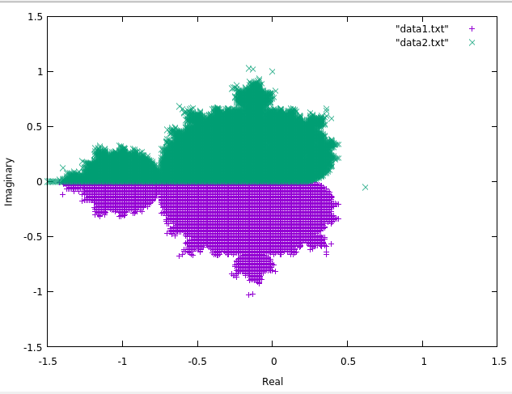

# Parallel functions

# Spec

- (plet form body)  

```
form   ((var1 sexp1)(var2 sexp2)...)
```
- (pcall fun arg ...)
eval (fun arg ...) with paralell

- (pexec arg ...)
execute (progn arg ...) with paralell

- (plock arg ...)
execute (prgn arg ...) with mutex. 

```
pthread_mutex_lock()
execute arg ...
pthread_mutex_unlock()
```

## example

```
(defun pfib (n)
    (plet ((a (fib (- n 1)))
           (b (fib (- n 2))))
        (+ a b)))

(defun fib (n)
    (the <fixnum> n) 
    (cond ((= n 0) 0)
          ((= n 1) 1)
          (t (+ (fib (- n 1)) (fib (- n 2))))))

(defun ptarai (x y z)
    (the <fixnum> x)(the <fixnum> y)(the <fixnum> z)
    (if (<= x y)
        y
        (pcall ptarai (ptarai (- x 1) y z)
                      (ptarai (- y 1) z x)
                      (ptarai (- z 1) x y))))

(defun tarai (x y z)
    (the <fixnum> x)(the <fixnum> y)(the <fixnum> z)
    (if (<= x y)
        y
        (tarai (tarai (- x 1) y z)
               (tarai (- y 1) z x)
               (tarai (- z 1) x y))))

(defun pcount (n)
    (pexec (count1 1 (div n 2))
           (count1 (+ (div n 2) 1) n)))

(defun count (n)
    (count1 1 n))

(defun count1 (m n)
    (for ((i m (+ i 1)))
         ((= i n) t)
         (sin (cos (tan i)))))

```

# Thread pooling
source code syntax.c line 2546

plet... f_plet
pcall.. f_pcall
pexec.. f_pexec
plock.. f_plock

queue[] = 1,2,3,... worker_count

worker_count = core_count - 1(main + GC);

core_count is count of CPU's multicores
e.g. icore5 hexa core => 6

initital
queue  [1,2,3,4]  hexa core
queue_pt = 4;

eval_para(arg)
dequeue [2,3,4]
queue_pt = 3
main thread send signal to worker1 thread.
worker1 eval(arg) -> para_output[1]=result.
worker1 send signal to main thread.
enqueue [2,3,4,1]
queue_pt = 4

## Example
see example/mandelbrot.lsp

