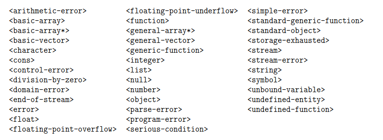
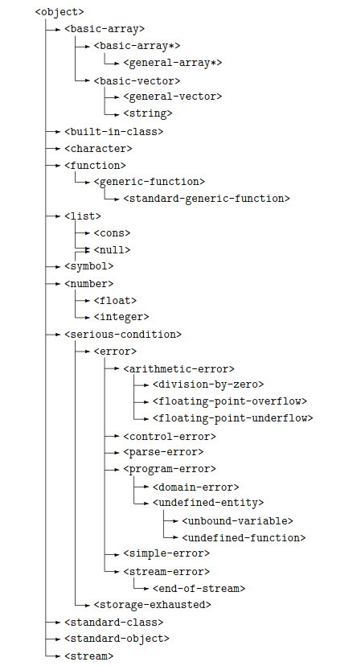

# Summary of ISLisp standard 

# convert function

```
(convert obj class)
```


# read function
## example

```
(defglobal str (create-string-input-stream "hello #(1 2 3) 123 #\\A"))⇒str
(read str)⇒hello
(read str)⇒#(1 2 3)
(read str)⇒123
(read str)⇒#\A
(read str nil "the end")⇒"the end"
```

# format functions
```
(format output-stream format-string obj*)
(format-char output-stream char)
(format-float output-stream float)
(format-fresh-line output-stream)
(format-integer output-stream integer radix)
(format-object output-stream obj escape-p)
(format-tab output-stream column)
```
### obj*
```
~A Aesthetic: 
~B Binary:
~C Character:
~D Decimal:
~G General floating point:
~O Octal: 
~nR Radix:
~S S-expression:
~nT Tab:
~X Hexadecimal:
~% newline:
~& conditional newline:
~~ tilde:
```

### Examples
```
(format output-stream "No result")⇒nilOutput is:No result
(format output-stream "The result is ~A and nothing else." "meningitis")⇒nilOutput is:The result is meningitis and nothing else.
(format output-stream "The result i~C" #\s)⇒nilOutput is:The result is
(format output-stream "The results are ~S and ~S." 1 #\a)⇒nilOutput is:The results are 1 and #\a.
(format output-stream "Binary code ~B" 150)⇒nilOutput is:Binary code 10010110
(format output-stream "permission ~O" 493)⇒nilOutput is:permission 755
(format output-stream "You ~X ~X" 2989 64206)⇒nilOutput is:You BAD FACE
(progn(format output-stream "~&Name ~10Tincome ~20Ttax~%")
(format output-stream "~A ~10T~D ~20T~D" "Grummy" 23000 7500))⇒nilOutput is:Name      income    taxGrummy    23000     7500
(format output-stream "This will be split into~%two lines.")⇒nilOutput is:This will be split intotwo lines.
(format output-stream "This is a tilde: ~~")⇒nilOutput is:This is a tilde: ~
```


# setf
```
(setf place form)
variables var
dynamic bindings (dynamic var)
the components of a basic-array (aref basic-array z1...zn)
the components of a general array (garef general-array z1...zn)
the components of a list (eltlist z)
the components of a vector (elt basic-vector z)
the left component of a cons (car cons)
the right component of a cons (cdr cons)
a property of a symbol (property symbol property)
a slot of an instance of a class (reader-function-name instance)
```

# Arguments different from common lisp
```
(set-car obj cons)
(set-cdr obj cons)
(set-propertyobj symbol property-name)
```

# defclass
```
(defclassclass-name(sc-name*)(slot-spec*)class-opt*)→<symbol>defining operator

Where:class-name::=identifier
sc-name::=identifier
slot-spec::=slot-name|(slot-name slot-opt*)
slot-name::=identifier
slot-opt::=:readerreader-function-name|:writerwriter-function-name|
:accessorreader-function-name|
:boundp boundp-function-name|
:initformform|:initarg
initarg-nameinitarg-name::=identifierreader-function-name::=identifierwriter-function-name::=identifierboundp-function-name::=identifierclass-opt::=(:metaclassclass-name)|
(:abstractpabstract-flag)abstract-flag::=t|
nil
```

# Predefined class



